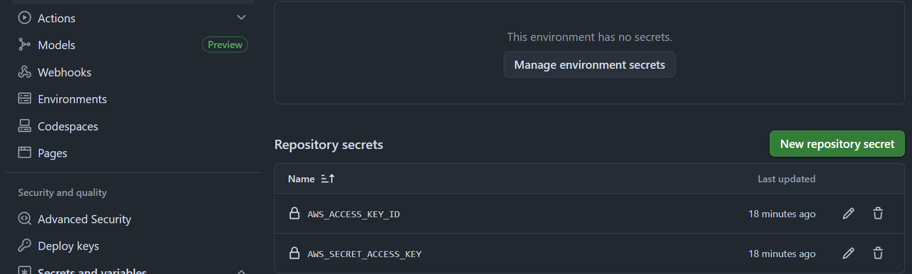
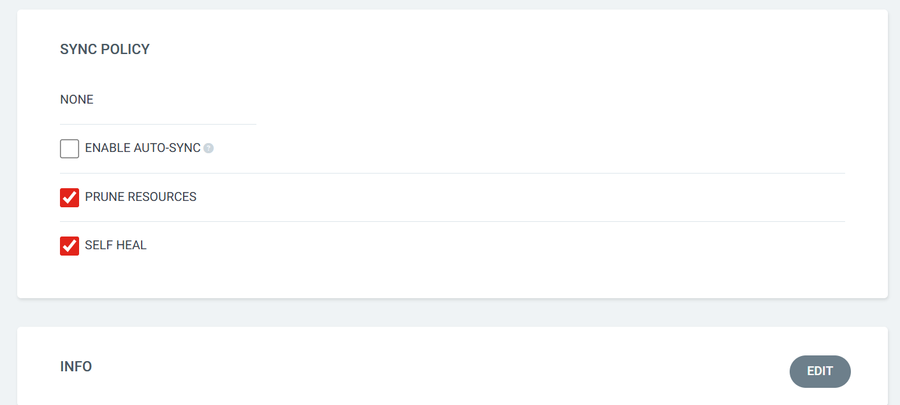

---

# 🚀 Docker, Kubernetes & KServe on AWS Setup

---

## 📌 Prerequisites

1. Login to AWS console
2. Create IAM user with `AdministratorAccess` or `s3FullAccess`
3. Create access keys
4. Create a repo in your github
5. Add secrets in github repo, got to your repo --> settings --> secrets and variables --> actions --> New repository secret
   1. AWS_ACCESS_KEY_ID
   2. AWS_SECRET_ACCESS_KEY
   3. 
6. Configure AWS CLI:


IAM user --> s3User
```bash
aws configure
```

4. Create an S3 bucket
5. Launch EC2 (Ubuntu) and allow port for example **5000**

---

## ⚙️ Basic Setup

```bash
sudo apt update && sudo apt upgrade -y
sudo apt install unzip net-tools -y
```

👉 Optional alias:

```bash
alias k='kubectl'
```

---

## ☁️ Install AWS CLI

```bash
curl "https://awscli.amazonaws.com/awscli-exe-linux-x86_64.zip" -o "awscliv2.zip"
unzip awscliv2.zip
sudo ./aws/install
```

---

## ⚡ Install UV

```bash
curl -LsSf https://astral.sh/uv/install.sh | sh
exit
```

---

## 🐳 Install Docker

Follow official docs:
[https://docs.docker.com/engine/install/ubuntu/](https://docs.docker.com/engine/install/ubuntu/)

```bash
sudo apt update
sudo apt install ca-certificates curl

sudo install -m 0755 -d /etc/apt/keyrings
sudo curl -fsSL https://download.docker.com/linux/ubuntu/gpg -o /etc/apt/keyrings/docker.asc
sudo chmod a+r /etc/apt/keyrings/docker.asc

sudo tee /etc/apt/sources.list.d/docker.sources <<EOF
Types: deb
URIs: https://download.docker.com/linux/ubuntu
Suites: $(. /etc/os-release && echo "${UBUNTU_CODENAME:-$VERSION_CODENAME}")
Components: stable
Architectures: $(dpkg --print-architecture)
Signed-By: /etc/apt/keyrings/docker.asc
EOF

sudo apt update
sudo apt install docker-ce docker-ce-cli containerd.io docker-buildx-plugin docker-compose-plugin -y
sudo usermod -aG docker $USER
exit
```

---

## 🧱 Install Kind

```bash
curl -Lo ./kind https://kind.sigs.k8s.io/dl/v0.31.0/kind-linux-amd64
chmod +x ./kind
sudo mv ./kind /usr/local/bin/kind
```

---

## ☸️ Install kubectl

```bash
curl -LO "https://dl.k8s.io/release/$(curl -L -s https://dl.k8s.io/release/stable.txt)/bin/linux/amd64/kubectl"
chmod +x kubectl
mkdir -p ~/.local/bin
mv ./kubectl ~/.local/bin/kubectl
```

---

## 📥 Clone Repository

```bash
git clone https://github.com/Kapil987/Kapil987-mlops-end-to-end2.git
cd Kapil987/kind
```
```bash
git clone https://github.com/Kapil987/Kapil987-mlops-end-to-end2.git -b dev
```

---

## 🧪 Kind Cluster

```bash
kind create cluster --config cluster-config.yml
kind get clusters
```

---

## 📦 Install Helm

```bash
curl -fsSL -o get_helm.sh https://raw.githubusercontent.com/helm/helm/main/scripts/get-helm-4
chmod 700 get_helm.sh
./get_helm.sh
```

---

## 🔐 Install Cert Manager

```bash
kubectl apply -f https://github.com/cert-manager/cert-manager/releases/download/v1.20.0/cert-manager.yaml

kubectl get pods -n cert-manager
```

---

## 🤖 Install KServe CRDs

```bash
kubectl create namespace kserve

helm install kserve-crd oci://ghcr.io/kserve/charts/kserve-crd \
  --version v0.16.0 \
  -n kserve \
  --wait
```

---

## 🧠 Install KServe Controller

```bash
helm upgrade --install kserve oci://ghcr.io/kserve/charts/kserve \
  --version v0.16.0 \
  -n kserve \
  --set kserve.controller.deploymentMode=RawDeployment

kubectl get pods -n kserve -w
```

---

## 🚀 KServe Deployment

```bash
kubectl apply -f k8s/1.serviceaccount.yaml
kubectl apply -f k8s/2.inference.yaml
```

```bash
kubectl get inferenceservice -n ml
kubectl get inferenceservice churn-predictor -n ml -w
```

⚠️ Ensure AWS credentials are updated in `3.secret.yaml`. Because we are updating secrets locally
it will take around 1 minute for InferenceService to get URL

```bash
ubuntu@ip-172-31-30-0:~/Kapil987-mlops-end-to-end2/k8s$ k get InferenceService -n ml
NAME              URL                                     READY   PREV   LATEST   PREVROLLEDOUTREVISION   LATESTREADYREVISION   AGE
churn-predictor   http://churn-predictor-ml.example.com   True       
```

---

## 📡 Test Inference

```bash
kubectl port-forward -n ml service/churn-predictor-predictor 8080:80 --address 0.0.0.0
```


```bash
curl -X POST http://localhost:8080/v1/models/churn-predictor:predict \
  -H "Content-Type: application/json" \
  -d '{
    "instances": [[45, 24, 79.99, 1920.00, 3]]
  }'
```

```bash
curl -X POST http://localhost:8090/v1/models/churn-predictor:predict \
  -H "Content-Type: application/json" \
  -d '{
    "instances": [[69,64,30.142082844921653,2933.852650794406,7]]
  }'
```

---

## 🔁 GitOps with ArgoCD

```bash
kubectl create namespace argocd

kubectl apply -n argocd \
  --server-side \
  --force-conflicts \
  -f https://raw.githubusercontent.com/argoproj/argo-cd/stable/manifests/install.yaml

kubectl apply -f argocd/application.yaml
```

```bash
kubectl port-forward svc/argocd-server -n argocd 8080:443 --address 0.0.0.0
```

```bash
kubectl -n argocd get secret argocd-initial-admin-secret \
  -o jsonpath="{.data.password}" | base64 -d && echo
```

---

## ⚠️ ArgoCD Note (Secrets)

Disable Auto-Sync from UI:

* Go to App → Click App Details
* Click **Disable Auto-Sync**
* 

---

## ⚙️ Kubectl Commands

```bash
k edit secrets s3-secret -n ml
kubectl apply -f deployment.yaml
kubectl get svc
kubectl describe po PODName -n namespace
kubectl port-forward svc/flask-service 8080:80 --address 0.0.0.0
```

---

## ☁️ AWS

👉 Open NodePort in EC2 Security Group

---

## 🛠️ Troubleshooting

### ❌ KServe webhook error
```bash
- Error
ubuntu@ip-172-31-30-0:~$ helm upgrade --install kserve oci://ghcr.io/kserve/charts/kserve \
  --version v0.16.0 \
  -n kserve \
  --set kserve.controller.deploymentMode=RawDeployment
Release "kserve" does not exist. Installing it now.
Pulled: ghcr.io/kserve/charts/kserve:v0.16.0
Digest: sha256:46d78a58fff65902213a7254ec16520286baa81d33340c4a03f5263d846e2124
Error: Internal error occurred: failed calling webhook "clusterservingruntime.kserve-webhook-server.validator": failed to call webhook: Post "https://kserve-webhook-server-service.kserve.svc:443/validate-serving-kserve-io-v1alpha1-clusterservingruntime?timeout=10s": dial tcp 10.96.133.27:443: connect: connection refused
Internal error occurred: failed calling webhook "clusterservingruntime.kserve-webhook-server.validator": failed to call webhook: Post "https://kserve-webhook-server-service.kserve.svc:443/validate-serving-kserve-io-v1alpha1-clusterservingruntime?timeout=10s": dial tcp 10.96.133.27:443: connect: connection refused
Internal error occurred: failed calling webhook "clusterservingruntime.kserve-webhook-server.validator": failed to call webhook: Post "https://kserve-webhook-server-service.kserve.svc:443/validate-serving-kserve-io-v1alpha1-clusterservingruntime?timeout=10s": dial tcp 10.96.133.27:443: connect: connection refused
ubuntu@ip-172-31-30-0:~$
👉 Solution: wait 1 minute and retry
```
---

### ❌ YAML update issue

```bash
yq e '.metadata.labels."model-version" = env(MODEL_VERSION)' -i k8s/inference.yaml
```

---

### ❌ Git branch commands

```bash
git checkout -b branch1 origin/branch1
git checkout -b branch2 origin/branch2
```

---